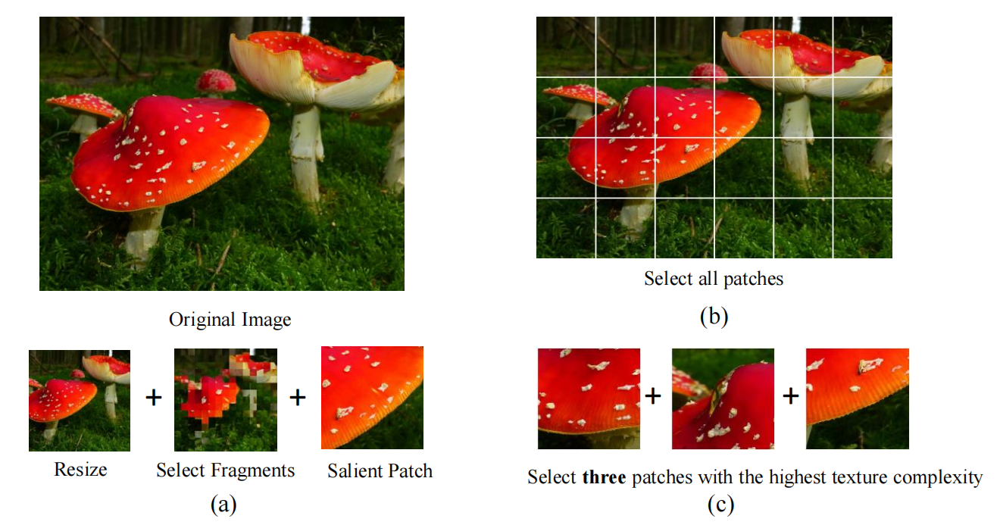
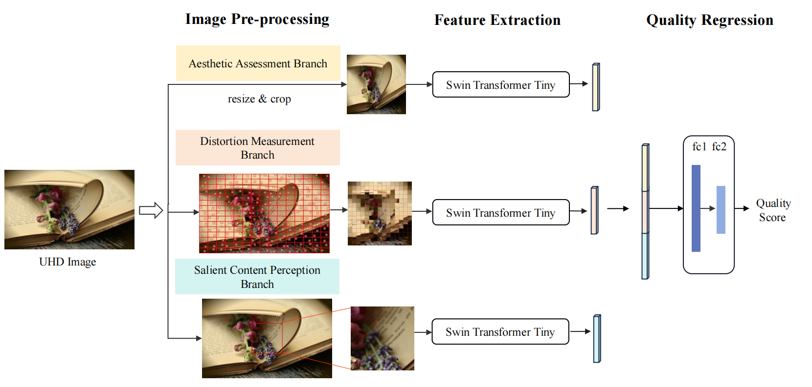
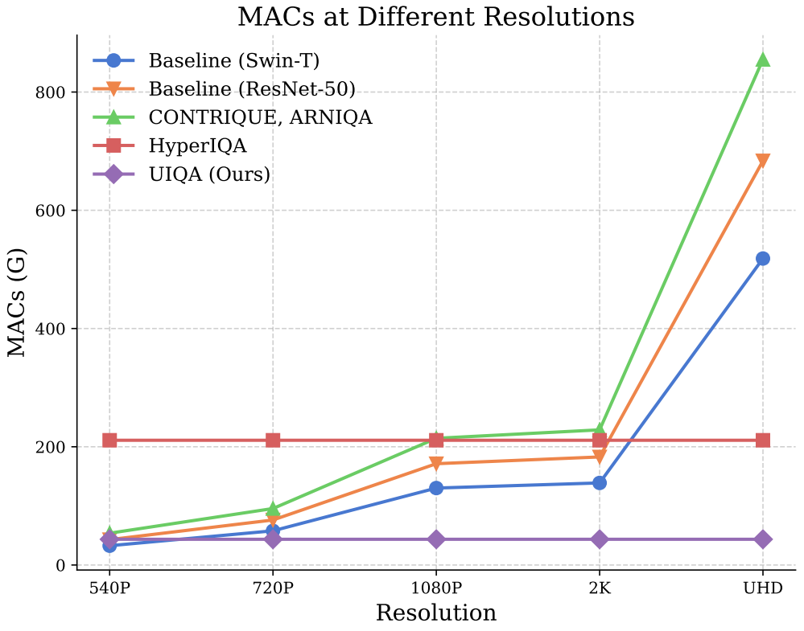

# UIQA

Official Code for **Assessing UHD Image Quality from Aesthetics, Distortions, and Saliency**

## Introduction
**UHD images**, typically with resolutions equal to or higher than 4K, pose a significant challenge for efficient image quality assessment (IQA) algorithms, as adopting full-resolution images as inputs leads to overwhelming computational complexity and commonly used pre-processing methods like resizing or cropping may cause substantial loss of detail. To address this problem, we design a multi-branch deep neural network (DNN) to assess the quality of UHD images from three perspectives: **global aesthetic characteristics, local technical distortions, and salient content perception**. Specifically, *aesthetic features are extracted from low-resolution images downsampled from the UHD ones*, which lose high-frequency texture information but still preserve the global aesthetics characteristics. *Technical distortions are measured using a fragment image composed of mini-patches cropped from UHD images based on the grid mini-patch sampling strategy*. *The salient content of UHD images is detected and cropped to extract quality-aware features from the salient regions*. We adopt the Swin Transformer Tiny as the backbone networks to extract features from these three perspectives. The extracted features are concatenated and regressed into quality scores by a two-layer multi-layer perceptron (MLP) network. We employ the mean square error (MSE) loss to optimize prediction accuracy and the fidelity loss to optimize prediction monotonicity. Experimental results show that the proposed model achieves the best performance on the UHD-IQA dataset while maintaining the lowest computational complexity, demonstrating its effectiveness and efficiency. Moreover, the proposed model won **first prize in ECCV AIM 2024 UHD-IQA Challenge**.

## Image Pre-processing

## Model

## Computationl Complexity
